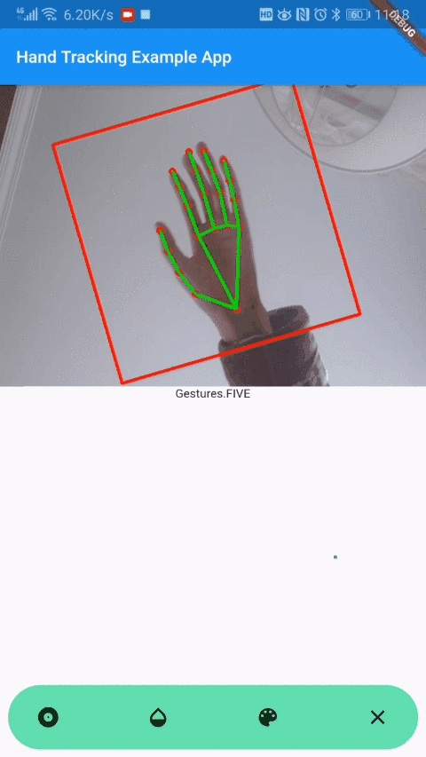
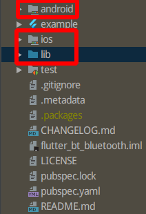
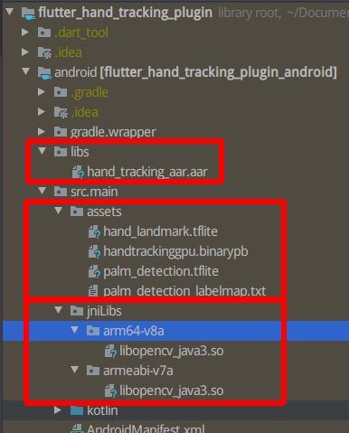

# Flutter Hand Tracking Plugin

<iframe src="//player.bilibili.com/player.html?aid=92842489&cid=158512320&page=1" scrolling="no" border="0" frameborder="no" framespacing="0" allowfullscreen="true"> </iframe>

这个 `Flutter Packge` 是为了实现调用 `Andorid` 设备摄像头精确追踪并识别十指的运动路径/轨迹和手势动作, 且输出22个手部关键点以支持更多手势自定义. 基于这个包可以编写业务逻辑将手势信息实时转化为指令信息: 一二三四五, rock, spiderman...同时基于 `Flutter` 可以对不同手势编写不同特效. 可用于短视频直播特效, 智能硬件等领域, 为人机互动带来更自然丰富的体验.



> 源码托管于 Github: [https://github.com/zhouzaihang/flutter_hand_tracking_plugin](https://github.com/zhouzaihang/flutter_hand_tracking_plugin)

## 使用

This project is a starting point for a Flutter
[plug-in package](https://flutter.dev/developing-packages/),
a specialized package that includes platform-specific implementation code for
Android.

For help getting started with Flutter, view our 
[online documentation](https://flutter.dev/docs), which offers tutorials, 
samples, guidance on mobile development, and a full API reference.

## 涉及到的技术

1. 编写一个 `Flutter Plugin Package`
1. 使用 `Docker` 配置 `MediaPipe` 开发环境
1. 在 `Gradle` 中使用 `MediaPipe`
1. `Flutter` 程序运行 `MediaPipe` 图
1. `Flutter` 页面中嵌入原生视图
1. `protobuf` 的使用

## 什么是 `Flutter Package`

`Flutter Package` 有以下两种类型:

`Dart Package`: 完全用 `Dart` 编写的包, 例如 `path` 包. 其中一些可能包含 `Flutter` 特定的功能, 这类包完全依赖于 `Flutter` 框架.

`Plugin Package`: 一类依赖于运行平台的包, 其中包含用 `Dart` 代码编写的 `API`, 并结合了针对 `Android` (使用 `Java` 或 `Kotlin`）和 `iOS` (使用 `ObjC` 或 `Swift`)平台特定的实现. 比如说 `battery` 包.

## 为什么需要 `Flutter Plugin Package`

`Flutter` 作为一个跨平台的 `UI` 框架, 本身是不能够直接调用原生的功能的. 如果需要使用原生系统的功能, 就需要对平台特定实现, 然后在 `Flutter` 的 `Dart` 层进行兼容. 
此处需要使用调用摄像头和 `GPU` 实现业务. 所以使用 `Flutter Plugin Package`.

## `Flutter Plugin Package` 是如何工作的

以下是 `Flutter Plugin Package` 项目的目录:



- 其中 `pubspec.yaml` 用于添加 `Plugin` 可能会用到的依赖或者资源(图片, 字体等)

- `example` 目录下是一个完整的 `Flutter APP`, 用于测试编写的 `Plugin`

- 另外, 无论在一个 `Flutter app` 项目还是在一个 `Flutter Plugin` 项目中都会有三个目录 `android`, `ios` 和 `lib`. `lib` 目录用于存放 `Dart` 代码, 而另外两个目录则是用于存放平台特定实现的代码.  `Flutter` 会运行根据实际运行平台来运行平台对应的代码, 然后使用 [Platform Channels](https://flutter.dev/docs/development/platform-integration/platform-channels?tab=android-channel-kotlin-tab) 把代码运行的结果返回给 `Dart` 层.

以下是 `Flutter` 官方给出的一张 `Flutter` 架构图:


从架构图中可以看到 `Flutter` 之所以是一个跨平台框架是因为有 `Embedder` 作为操作系统适配层, `Engine` 层实现渲染引擎等功能, 而 `Framework` 层是一个用 `Dart` 实现的 `UI SDK`. 对于一个 `Flutter Plugin Package` 来说, 就是要在 `Embedder` 层用原生的平台特定实现, 并且在 `Dart` 层中封装为一个 `UI API`, 从而实现跨平台. `Embedder` 层并不能直接和 `Framework` 直接连接, 还必须经过 `Engine` 层的 `Platform Channels`.

使用 `Platform Channels` 在客户端(`UI`) 和主机(特定平台)之间传递的过程如下图所示:


## 新建 `Flutter Plugin Package`

1. 打开 `Android Studio`, 点击 `New Flutter Project`
1. 选择 `Flutter Plugin` 选项
1. 输入项目名字, 描述等信息

## 编写 `Android` 平台 `view`

首先在 `android/src/main/kotlin/xyz/zhzh/flutter_hand_tracking_plugin` 目录下创建两个 `kotlin` 文件: `FlutterHandTrackingPlugin.kt` 和 `HandTrackingViewFactory.kt` 文件.

### 编写 `Factory` 类

在 `HandTrackingViewFactory.kt` 中编写一个 `HandTrackingViewFactory` 类实现抽象类 `PlatformViewFactory`. 之后编写的 `Android` 平台组件都需要用这个 `Factory` 类来生成. 在生成视图的时候需要传入一个参数 `id` 来辨别视图(`id`会由 `Flutter` 创建并传递给 `Factory`):

``` Kotlin
package xyz.zhzh.flutter_hand_tracking_plugin

import android.content.Context
import io.flutter.plugin.common.PluginRegistry
import io.flutter.plugin.common.StandardMessageCodec
import io.flutter.plugin.platform.PlatformView
import io.flutter.plugin.platform.PlatformViewFactory

class HandTrackingViewFactory(private val registrar: PluginRegistry.Registrar) :
        PlatformViewFactory(StandardMessageCodec.INSTANCE) {
    override fun create(context: Context?, viewId: Int, args: Any?): PlatformView {
        return FlutterHandTrackingPlugin(registrar, viewId)
    }
}
```

### 编写 `AndroidView` 类

在 `FlutterHandTrackingPlugin.kt` 中编写 `FlutterHandTrackingPlugin` 实现 `PlatformView` 接口, 这个接口需要实现两个方法 `getView` 和 `dispose`.

`getView` 用于返回一个将要嵌入到 `Flutter` 界面的视图

`dispose` 则是在试图关闭的时候进行一些操作

首先要添加一个 `SurfaceView`:

``` kotlin
class FlutterHandTrackingPlugin(r: Registrar, id: Int) : PlatformView, MethodCallHandler {
    companion object {
        private const val TAG = "HandTrackingPlugin"
        private const val NAMESPACE = "plugins.zhzh.xyz/flutter_hand_tracking_plugin"

        @JvmStatic
        fun registerWith(registrar: Registrar) {
            registrar.platformViewRegistry().registerViewFactory(
                    "$NAMESPACE/view",
                    HandTrackingViewFactory(registrar))
        }

        init { // Load all native libraries needed by the app.
            System.loadLibrary("mediapipe_jni")
            System.loadLibrary("opencv_java3")
        }
    }
    private var previewDisplayView: SurfaceView = SurfaceView(r.context())
}
```

然后通过 `getView` 返回添加的 `SurfaceView`:

``` kotlin
class FlutterHandTrackingPlugin(r: Registrar, id: Int) : PlatformView, MethodCallHandler {
    // ...
    override fun getView(): SurfaceView? {
        return previewDisplayView
    }

    override fun dispose() {
        // TODO: ViewDispose()
    }
}
```

## 在 `Dart` 中调用原生实现的 `View`

> 打开 `plugin package` 项目的 `lib/flutter_hand_tracking_plugin.dart` 进行编辑(具体文件名依据新建项目时创建的包名). 

在 `Flutter` 中调用原生的 `Android` 组件需要创建一个 `AndroidView` 并告诉它组建的注册名称, 创建 `AndroidView` 的时候, 会给组件分配一个 `id`, 这个 `id` 可以通过参数 `onPlatformViewCreated` 传入方法获得:

``` dart
AndroidView(
    viewType: '$NAMESPACE/blueview',
    onPlatformViewCreated: (id) => _id = id),
)
```

由于只实现了 `Android` 平台的组件, 在其他系统上并不可使用, 所以还需要获取 `defaultTargetPlatform` 来判断运行的平台:

``` dart
import 'dart:async';

import 'package:flutter/cupertino.dart';
import 'package:flutter/foundation.dart';
import 'package:flutter/services.dart';
import 'package:flutter_hand_tracking_plugin/gen/landmark.pb.dart';

const NAMESPACE = "plugins.zhzh.xyz/flutter_hand_tracking_plugin";

typedef void HandTrackingViewCreatedCallback(
    HandTrackingViewController controller);

class HandTrackingView extends StatelessWidget {
  const HandTrackingView({@required this.onViewCreated})
      : assert(onViewCreated != null);

  final HandTrackingViewCreatedCallback onViewCreated;

  @override
  Widget build(BuildContext context) {
    switch (defaultTargetPlatform) {
      case TargetPlatform.android:
        return AndroidView(
          viewType: "$NAMESPACE/view",
          onPlatformViewCreated: (int id) => onViewCreated == null
              ? null
              : onViewCreated(HandTrackingViewController._(id)),
        );
      case TargetPlatform.fuchsia:
      case TargetPlatform.iOS:
      default:
        throw UnsupportedError(
            "Trying to use the default webview implementation for"
            " $defaultTargetPlatform but there isn't a default one");
    }
  }
}
```

上面使用 `typedef` 定义了一个 `HandTrackingViewCreatedCallback`, 传入的参数类型为 `HandTrackingViewController`, 这个 `controller` 用于管理对应 `AndroidView` 的 `id`:

``` dart
class HandTrackingViewController {
  final MethodChannel _methodChannel;

  HandTrackingViewController._(int id)
      : _methodChannel = MethodChannel("$NAMESPACE/$id"),
        _eventChannel = EventChannel("$NAMESPACE/$id/landmarks");

  Future<String> get platformVersion async =>
      await _methodChannel.invokeMethod("getPlatformVersion");
}
```

其中的 `MethodChannel` 用于调用 `Flutter Plugin Package` 的方法, 本次不需要使用到 `MethodChannel`, 所以不用关注.

## 使用 `Docker` 构建 `MediaPipe AAR` 并添加到项目中

`MediaPipe` 是一个 `Google` 发布的使用 `ML pipelines` 技术构建多个模型连接在一起的跨平台框架. (`Machine learning pipelines`: 简单说就是一套 `API` 解决各个模型/算法/`workflow` 之间的数据传输). `MediaPipe` 支持视频, 音频, 等任何 `time series data`([WiKi--Time Series](https://en.wikipedia.org/wiki/Time_series)).

这里利用 `MediaPipe` 将摄像头数据传入到手势检测的 `TFlite` 模型中处理. 然后再把整套程序构建为 `Android archive library`.

`MediaPipe Android archive library` 是一个把 `MediaPipe` 与 `Gradle` 一起使用的方法. `MediaPipe` 不会发布可用于所有项目的常规AAR, 所以需要开发者自行构建. 这是官方给出的. 笔者这里是 `Ubuntu` 系统, 选择了 `Docker` 的安装方式(`git clone` 和 `docker pull` 的时候网络不稳定的话可以设置一下 `proxy` 或换源).

安装完成后使用 `docker exec -it mediapipe /bin/bash` 进入 `bash` 操作.

### 创建一个 `mediapipe_aar()`

首先在 `mediapipe/examples/android/src/java/com/google/mediapipe/apps/aar_example` 里创建一个 `BUILD` 文件, 并把一下内容添加到文本文件里.

``` build
load("//mediapipe/java/com/google/mediapipe:mediapipe_aar.bzl", "mediapipe_aar")

mediapipe_aar(
    name = "hand_tracking_aar",
    calculators = ["//mediapipe/graphs/hand_tracking:mobile_calculators"],
)
```

### 生成 `aar`

根据上面创建的文本文件, 运行 `bazel build` 命令就可以生成一个 `AAR`, 其中 `--action_env=HTTP_PROXY=$HTTP_PROXY`, 这个参数是用来指定设置代理的(因为在构建的过程中会从 `Github` 下载很多依赖.)

``` bash
bazel build -c opt --action_env=HTTP_PROXY=$HTTP_PROXY --action_env=HTTPS_PROXY=$HTTPS_PROXY --fat_apk_cpu=arm64-v8a,armeabi-v7a mediapipe/examples/android/src/java/com/google/mediapipe/apps/aar_example:hand_tracking_aar
```

在容器内的 `/mediapipe/examples/android/src/java/com/google/mediapipe/apps/aar_example` 路径下, 你可以找到刚刚构建得到的 `hand_tracking_aar.aar`, 使用 `docker cp` 从容器中拷贝到项目的 `android/libs` 下.

### 生成 `binary graph`

上面的 `aar` 执行还需要依赖 `MediaPipe binary graph`, 使用以下命令可以构建生成一个 `binary graph`:

``` bash
bazel build -c opt mediapipe/examples/android/src/java/com/google/mediapipe/apps/handtrackinggpu:binary_graph
```

从 `bazel-bin/mediapipe/examples/android/src/java/com/google/mediapipe/apps/handtrackinggpu` 中拷贝刚才 `build` 出来的 `binary graph`, 当到 `android/src/main/assets` 下

### 添加 `assets` 和 `OpenCV library`

在容器的 `/mediapipe/models` 目录下, 会找到 `hand_lanmark.tflite`, `palm_detection.tflite` 和 `palm_detection_labelmap.txt` 把这些也拷贝出来放到 `android/src/main/assets` 下.

另外 `MediaPipe` 依赖 `OpenCV`, 是哦一需要下载 `OpenCV` 预编译的 `JNI libraries` 库, 并放置到 `android/src/main/jniLibs` 路径下. 可以从[此处](https://github.com/opencv/opencv/releases/download/3.4.3/opencv-3.4.3-android-sdk.zip)下载官方的 `OpenCV Android SDK` 然后运行 `cp` 放到对应路径中

``` bash
cp -R ~/Downloads/OpenCV-android-sdk/sdk/native/libs/arm* /path/to/your/plugin/android/src/main/jniLibs/
```



`MediaPipe` 框架使用 `OpenCV`, 要加载 `MediaPipe` 框架首先要在 `Flutter Plugin` 中加载 `OpenCV`, 在 `FlutterHandTrackingPlugin` 的 `companion object` 中使用以下代码来加载这两个依赖项:

``` kotlin
class FlutterHandTrackingPlugin(r: Registrar, id: Int) : PlatformView, MethodCallHandler {
    companion object {
        init { // Load all native libraries needed by the app.
            System.loadLibrary("mediapipe_jni")
            System.loadLibrary("opencv_java3")
        }
    }
}
```

### 修改 `build.grage`

打开 `android/build.gradle`, 添加 `MediaPipe dependencies` 和 `MediaPipe AAR` 到 `app/build.gradle`:

```
dependencies {
    implementation "org.jetbrains.kotlin:kotlin-stdlib-jdk7:$kotlin_version"
    implementation fileTree(dir: 'libs', include: ['*.aar'])
    // MediaPipe deps
    implementation 'com.google.flogger:flogger:0.3.1'
    implementation 'com.google.flogger:flogger-system-backend:0.3.1'
    implementation 'com.google.code.findbugs:jsr305:3.0.2'
    implementation 'com.google.guava:guava:27.0.1-android'
    implementation 'com.google.guava:guava:27.0.1-android'
    implementation 'com.google.protobuf:protobuf-lite:3.0.1'
    // CameraX core library
    def camerax_version = "1.0.0-alpha06"
    implementation "androidx.camera:camera-core:$camerax_version"
    implementation "androidx.camera:camera-camera2:$camerax_version"
    implementation "androidx.core:core-ktx:1.2.0"
}
```

## 通过 `CameraX` 调用摄像头

### 获取摄像头权限

要在我们的应用程序中使用相机, 我们需要请求用户提供对相机的访问权限. 要请求相机权限, 请将以下内容添加到 `android/src/main/AndroidManifest.xml`:

``` xml
<!-- For using the camera -->
<uses-permission android:name="android.permission.CAMERA" />

<uses-feature android:name="android.hardware.camera" />
<uses-feature android:name="android.hardware.camera.autofocus" />
<!-- For MediaPipe -->
<uses-feature
    android:glEsVersion="0x00020000"
    android:required="true" />
```

同时在 `build.gradle` 中将最低 `SDK` 版本更改为 `21` 以上, 并将目标 `SDK` 版本更改为 `27` 以上

``` Gradle Script
defaultConfig {
    // TODO: Specify your own unique Application ID (https://developer.android.com/studio/build/application-id.html).
    applicationId "xyz.zhzh.flutter_hand_tracking_plugin_example"
    minSdkVersion 21
    targetSdkVersion 27
    versionCode flutterVersionCode.toInteger()
    versionName flutterVersionName
    testInstrumentationRunner "androidx.test.runner.AndroidJUnitRunner"
}
```

为了确保提示用户请求照相机权限, 并使我们能够使用 `CameraX` 库访问摄像头. 请求摄像机许可, 可以使用 `MediaPipe` 组件提供的组建 `PermissionHelper` 要使用它. 首先在组件 `init` 内添加请求权限的代码:

``` kotlin
PermissionHelper.checkAndRequestCameraPermissions(activity)
```

这会在屏幕上以对话框提示用户, 以请求在此应用程序中使用相机的权限.

然后在添加以下代码来处理用户响应:

``` kotlin
class FlutterHandTrackingPlugin(r: Registrar, id: Int) : PlatformView, MethodCallHandler {
    private val activity: Activity = r.activity()

    init {
        // ...
        r.addRequestPermissionsResultListener(CameraRequestPermissionsListener())
        PermissionHelper.checkAndRequestCameraPermissions(activity)
        if (PermissionHelper.cameraPermissionsGranted(activity)) onResume()
    }

    private inner class CameraRequestPermissionsListener :
            PluginRegistry.RequestPermissionsResultListener {
        override fun onRequestPermissionsResult(requestCode: Int,
                                                permissions: Array<out String>?,
                                                grantResults: IntArray?): Boolean {
            return if (requestCode != 0) false
            else {
                for (result in grantResults!!) {
                    if (result == PERMISSION_GRANTED) onResume()
                    else Toast.makeText(activity, "请授予摄像头权限", Toast.LENGTH_LONG).show()
                }
                true
            }
        }
    }

    private fun onResume() {
        // ...
        if (PermissionHelper.cameraPermissionsGranted(activity)) startCamera()
    }
    private fun startCamera() {}
}
```

暂时将 `startCamera()` 方法保留为空. 当用户响应提示后, `onResume()` 方法会被调用调用. 该代码将确认已授予使用相机的权限, 然后将启动相机.

### 调用摄像头

现在将 `SurfaceTexture` 和 `SurfaceView` 添加到插件:

``` kotlin
// {@link SurfaceTexture} where the camera-preview frames can be accessed.
private var previewFrameTexture: SurfaceTexture? = null
// {@link SurfaceView} that displays the camera-preview frames processed by a MediaPipe graph.
private var previewDisplayView: SurfaceView = SurfaceView(r.context())
```

在组件 `init` 的方法里, 添加 `setupPreviewDisplayView()` 方法到请求请求摄像头权限的前面:

``` kotlin
init {
    r.addRequestPermissionsResultListener(CameraRequestPermissionsListener())

    setupPreviewDisplayView()
    PermissionHelper.checkAndRequestCameraPermissions(activity)
    if (PermissionHelper.cameraPermissionsGranted(activity)) onResume()
}
```

然后编写 `setupPreviewDisplayView` 方法:

``` kotlin
private fun setupPreviewDisplayView() {
    previewDisplayView.visibility = View.GONE
    // TODO
}
```

要 `previewDisplayView` 用于获取摄像头的数据, 可以使用 `CameraX`, `MediaPipe` 提供了一个名为 `CameraXPreviewHelper` 的类使用 `CameraX`. 开启相机时, 可以更新监听函数 `onCameraStarted(@Nullable SurfaceTexture)`

现在定义一个 `CameraXPreviewHelper`:

``` kotlin
class FlutterHandTrackingPlugin(r: Registrar, id: Int) : PlatformView, MethodCallHandler {
    // ...
    private var cameraHelper: CameraXPreviewHelper? = null
    // ...
}
```

然后实现之前的 `startCamera()`:

``` kotlin
private fun startCamera() {
    cameraHelper = CameraXPreviewHelper()
    cameraHelper!!.setOnCameraStartedListener { surfaceTexture: SurfaceTexture? ->
        previewFrameTexture = surfaceTexture
        // Make the display view visible to start showing the preview. This triggers the
        // SurfaceHolder.Callback added to (the holder of) previewDisplayView.
        previewDisplayView.visibility = View.VISIBLE
    }
    cameraHelper!!.startCamera(activity, CAMERA_FACING,  /*surfaceTexture=*/null)
}
```

这将 `new` 一个 `CameraXPreviewHelper` 对象, 并在该对象上添加一个匿名监听. 当有 `cameraHelper` 监听到相机已启动时, `surfaceTexture` 可以抓取摄像头帧, 将其传给 `previewFrameTexture`, 并使 `previewDisplayView` 可见.

在调用摄像头时, 需要确定要使用的相机. `CameraXPreviewHelper` 继承 `CameraHelper` 的两个选项: `FRONT` 和 `BACK`. 并且作为参数 `CAMERA_FACING` 传入 `cameraHelper!!.startCamera` 方法. 这里设置前置摄像头为一个静态变量: 

``` kotlin
class FlutterHandTrackingPlugin(r: Registrar, id: Int) : PlatformView, MethodCallHandler {
    companion object {
        private val CAMERA_FACING = CameraHelper.CameraFacing.FRONT
        // ...
    }
    //...
}
```
## 使用 `ExternalTextureConverter` 转换摄像头图像帧数据

上面使用 `SurfaceTexture` 将流中的摄像头图像帧捕获并存在 `OpenGL ES texture` 对象中. 要使用 `MediaPipe graph`, 需要把摄像机捕获的帧存在在普通的 `Open GL texture` 对象中. `MediaPipe` 提供了类 `ExternalTextureConverter` 类用于将存储在 `SurfaceTexture` 对象中的图像帧转换为常规 `OpenGL texture` 对象.

要使用 `ExternalTextureConverter`, 还需要一个由 `EglManager` 对象创建和管理的 `EGLContext`. 在插件中添加以下声明:

``` kotlin
// Creates and manages an {@link EGLContext}.
private var eglManager: EglManager = EglManager(null)

// Converts the GL_TEXTURE_EXTERNAL_OES texture from Android camera into a regular texture to be
// consumed by {@link FrameProcessor} and the underlying MediaPipe graph.
private var converter: ExternalTextureConverter? = null
```

修改之前编写的 `onResume()` 方法添加初始化 `converter` 对象的代码:

``` kotlin
private fun onResume() {
    converter = ExternalTextureConverter(eglManager.context)
    converter!!.setFlipY(FLIP_FRAMES_VERTICALLY)
    if (PermissionHelper.cameraPermissionsGranted(activity)) {
        startCamera()
    }
}
```

要把 `previewFrameTexture` 传输到 `converter` 进行转换, 将以下代码块添加到 `setupPreviewDisplayView()`:

``` kotlin
private fun setupPreviewDisplayView() {
    previewDisplayView.visibility = View.GONE
    previewDisplayView.holder.addCallback(
            object : SurfaceHolder.Callback {
                override fun surfaceCreated(holder: SurfaceHolder) {
                    processor.videoSurfaceOutput.setSurface(holder.surface)
                }

                override fun surfaceChanged(holder: SurfaceHolder, format: Int, width: Int, height: Int) { // (Re-)Compute the ideal size of the camera-preview display (the area that the
                    // camera-preview frames get rendered onto, potentially with scaling and rotation)
                    // based on the size of the SurfaceView that contains the display.
                    val viewSize = Size(width, height)
                    val displaySize = cameraHelper!!.computeDisplaySizeFromViewSize(viewSize)
                    val isCameraRotated = cameraHelper!!.isCameraRotated
                    // Connect the converter to the camera-preview frames as its input (via
                    // previewFrameTexture), and configure the output width and height as the computed
                    // display size.
                    converter!!.setSurfaceTextureAndAttachToGLContext(
                            previewFrameTexture,
                            if (isCameraRotated) displaySize.height else displaySize.width,
                            if (isCameraRotated) displaySize.width else displaySize.height)
                }

                override fun surfaceDestroyed(holder: SurfaceHolder) {
                    // TODO
                }
            })
}
```

在上面的代码中, 首先自定义并添加 `SurfaceHolder.Callback` 到 `previewDisplayView` 并实现 `surfaceChanged(SurfaceHolder holder, int format, int width, int height)`: 

1. 计算摄像头的帧在设备屏幕上适当的显示尺寸
2. 传入 `previewFrameTexture` 和 `displaySize` 到 `converter`

现在摄像头获取到的图像帧已经可以传入到 `MediaPipe graph` 中了.

## 调用 `MediaPipe graph`

首先需要加载所有 `MediaPipe graph` 需要的资源(之前从容器中拷贝出来的 `tflite` 模型, `binary graph` 等) 可以使用 `MediaPipe` 的组件 `AndroidAssetUtil` 类:

``` kotlin
// Initialize asset manager so that MediaPipe native libraries can access the app assets, e.g.,
// binary graphs.
AndroidAssetUtil.initializeNativeAssetManager(activity)
```

然后添加以下代码设置 `processor`:

```
init {
    setupProcess()
}

private fun setupProcess() {
    processor.videoSurfaceOutput.setFlipY(FLIP_FRAMES_VERTICALLY)
    // TODO
}
```

然后根据用到的 `graph` 的名称声明静态变量, 这些静态变量用于之后使用 `graph`:

```
class FlutterHandTrackingPlugin(r: Registrar, id: Int) : PlatformView, MethodCallHandler {
    companion object {
        private const val BINARY_GRAPH_NAME = "handtrackinggpu.binarypb"
        private const val INPUT_VIDEO_STREAM_NAME = "input_video"
        private const val OUTPUT_VIDEO_STREAM_NAME = "output_video"
        private const val OUTPUT_HAND_PRESENCE_STREAM_NAME = "hand_presence"
        private const val OUTPUT_LANDMARKS_STREAM_NAME = "hand_landmarks"
    }
}
```

现在设置一个 `FrameProcessor` 对象, 把之前 `converter` 转换好的的摄像头图像帧发送到 `MediaPipe graph` 并运行该图获得输出的图像帧, 然后更新 `previewDisplayView` 来显示输出. 添加以下代码以声明 `FrameProcessor`:

``` kotlin
// Sends camera-preview frames into a MediaPipe graph for processing, and displays the processed
// frames onto a {@link Surface}.
private var processor: FrameProcessor = FrameProcessor(
        activity,
        eglManager.nativeContext,
        BINARY_GRAPH_NAME,
        INPUT_VIDEO_STREAM_NAME,
        OUTPUT_VIDEO_STREAM_NAME)
```

然后编辑 `onResume()` 通过 `converter!!.setConsumer(processor)` 设置 `convert` 把转换好的图像帧输出到 `processor`:

``` kotlin
private fun onResume() {
    converter = ExternalTextureConverter(eglManager.context)
    converter!!.setFlipY(FLIP_FRAMES_VERTICALLY)
    converter!!.setConsumer(processor)
    if (PermissionHelper.cameraPermissionsGranted(activity)) {
        startCamera()
    }
}
```

接着就是把 `processor` 处理后的图像帧输出到 `previewDisplayView`. 重新编辑 `setupPreviewDisplayView` 修改之前定义的 `SurfaceHolder.Callback`:

``` kotlin
private fun setupPreviewDisplayView() {
    previewDisplayView.visibility = View.GONE
    previewDisplayView.holder.addCallback(
            object : SurfaceHolder.Callback {
                override fun surfaceCreated(holder: SurfaceHolder) {
                    processor.videoSurfaceOutput.setSurface(holder.surface)
                }

                override fun surfaceChanged(holder: SurfaceHolder, format: Int, width: Int, height: Int) {
                    // (Re-)Compute the ideal size of the camera-preview display (the area that the
                    // camera-preview frames get rendered onto, potentially with scaling and rotation)
                    // based on the size of the SurfaceView that contains the display.
                    val viewSize = Size(width, height)
                    val displaySize = cameraHelper!!.computeDisplaySizeFromViewSize(viewSize)
                    val isCameraRotated = cameraHelper!!.isCameraRotated
                    // Connect the converter to the camera-preview frames as its input (via
                    // previewFrameTexture), and configure the output width and height as the computed
                    // display size.
                    converter!!.setSurfaceTextureAndAttachToGLContext(
                            previewFrameTexture,
                            if (isCameraRotated) displaySize.height else displaySize.width,
                            if (isCameraRotated) displaySize.width else displaySize.height)
                }

                override fun surfaceDestroyed(holder: SurfaceHolder) {
                    processor.videoSurfaceOutput.setSurface(null)
                }
            })
}
```

当 `SurfaceHolder` 被创建时, 摄像头图像帧就会经由 `convert` 转换后输出到 `processor`, 然后再通过 `VideoSurfaceOutput` 输出一个 `Surface`.

## 通过 `EventChannel` 实现原生组件与 `Flutter` 的通讯

之前的处理仅仅在处理图像帧, `processor` 除了处理图像之外, 还可以获取手部关键点的坐标. 通过 `EventChannel` 可以把这些数据传输给 `Flutter` 的 `Dart` 层, 进而根据这些关键点可以编写各种业务逻辑将手势信息实时转化为指令信息: 一二三四五, rock, spiderman...或者对不同手势编写不同特效. 从而为人机互动带来更自然丰富的体验.

### 在 `Android` 平台打开 `EventChannel`

首先定义一个 `EventChannel` 和一个 `EventChannel.EventSink`:

``` kotlin
private val eventChannel: EventChannel = EventChannel(r.messenger(), "$NAMESPACE/$id/landmarks")
private var eventSink: EventChannel.EventSink? = null
```

`EventChannel.EventSink` 用于之后发送消息. 然后在 `init` 方法中初始化 `eventChannel`:

``` kotlin
inti {
    this.eventChannel.setStreamHandler(landMarksStreamHandler())
}

private fun landMarksStreamHandler(): EventChannel.StreamHandler {
    return object : EventChannel.StreamHandler {

        override fun onListen(arguments: Any?, events: EventChannel.EventSink) {
            eventSink = events
            // Log.e(TAG, "Listen Event Channel")
        }

        override fun onCancel(arguments: Any?) {
            eventSink = null
        }
    }
}
```

设置完消息通道后, 编辑之前的 `setupProcess()` 方法. 在设置 `processor` 的输出前添加代码, 实现获得手部关键点的位置并通过 `EventChannel.EventSink` 发送到之前打开的 `eventChannel`:

``` kotlin
private val uiThreadHandler: Handler = Handler(Looper.getMainLooper())

private fun setupProcess() {
    processor.videoSurfaceOutput.setFlipY(FLIP_FRAMES_VERTICALLY)
    processor.addPacketCallback(
            OUTPUT_HAND_PRESENCE_STREAM_NAME
    ) { packet: Packet ->
        val handPresence = PacketGetter.getBool(packet)
        if (!handPresence) Log.d(TAG, "[TS:" + packet.timestamp + "] Hand presence is false, no hands detected.")
    }
    processor.addPacketCallback(
            OUTPUT_LANDMARKS_STREAM_NAME
    ) { packet: Packet ->
        val landmarksRaw = PacketGetter.getProtoBytes(packet)
        if (eventSink == null) try {
            val landmarks = LandmarkProto.NormalizedLandmarkList.parseFrom(landmarksRaw)
            if (landmarks == null) {
                Log.d(TAG, "[TS:" + packet.timestamp + "] No hand landmarks.")
                return@addPacketCallback
            }
            // Note: If hand_presence is false, these landmarks are useless.
            Log.d(TAG, "[TS: ${packet.timestamp}] #Landmarks for hand: ${landmarks.landmarkCount}\n ${getLandmarksString(landmarks)}")
        } catch (e: InvalidProtocolBufferException) {
            Log.e(TAG, "Couldn't Exception received - $e")
            return@addPacketCallback
        }
        else uiThreadHandler.post { eventSink?.success(landmarksRaw) }
    }
}
```

这里 `LandmarkProto.NormalizedLandmarkList.parseFrom()` 用来解析标记点 `byte array` 格式的数据. 因为所有标记点的数据都是使用 `protobuf` 封装的. `Protocol buffers` 是一种 `Google` 可以在各种语言使用的跨平台序列化结构数据的工具, 详情可以查看[官网](https://developers.google.com/protocol-buffers).

另外最后用到了 `uiThreadHandler` 来发送数据, 因为 `processor` 的 `callback` 会在线程中执行, 但是 `Flutter` 框架往 `eventChannel` 里发送消息需要在 `UI` 线程中, 所以使用 `uiThreadHandler` 来 `post`.

完整的 `FlutterHandTrackingPlugin.kt` 的详情可见[github](https://github.com/zhouzaihang/flutter_hand_tracking_plugin)

### 在 `Dart` 层获得 `eventChannel` 的数据

再一次打开 `lib/flutter_hand_tracking_plugin.dart`, 编辑 `HandTrackingViewController` 类. 根据 `id` 添加一个 `EventChannel`, 然后使用 `receiveBroadcastStream` 接受这个通道消息:

``` dart
class HandTrackingViewController {
  final MethodChannel _methodChannel;
  final EventChannel _eventChannel;

  HandTrackingViewController._(int id)
      : _methodChannel = MethodChannel("$NAMESPACE/$id"),
        _eventChannel = EventChannel("$NAMESPACE/$id/landmarks");

  Future<String> get platformVersion async =>
      await _methodChannel.invokeMethod("getPlatformVersion");

  Stream<NormalizedLandmarkList> get landMarksStream async* {
    yield* _eventChannel
        .receiveBroadcastStream()
        .map((buffer) => NormalizedLandmarkList.fromBuffer(buffer));
  }
}
```

之前已经介绍过了, 传输的数据格式是使用 `protobuf` 序列化的有一定结构的 `byte array`. 所以需要使用 `NormalizedLandmarkList.fromBuffer()`, 来解析. `NormalizedLandmarkList.fromBuffer()` 这个接口, 是由 `protobuf` 根据 [protos/landmark.proto](https://github.com/zhouzaihang/flutter_hand_tracking_plugin/blob/master/protos/landmark.proto) 生成的 `.dart` 文件提供.

首先打开 `pubspec.yaml` 添加 `protoc_plugin` 的依赖:

``` yaml
dependencies:
  flutter:
    sdk: flutter
  protobuf: ^1.0.1
```

然后安装和激活插件:

``` bash
pub install
pub global activate protoc_plugin
```

再根据[protobuf 安装教程](https://github.com/google/protobuf)配置 `Protocol`

然后运行 `protoc` 命令就可以生成 `.dart` 文件了:

``` bash
protoc --dart_out=../lib/gen ./landmark.proto
```

也可以直接使用已经生成好的[flutter_hand_tracking_plugin/lib/gen/](https://github.com/zhouzaihang/flutter_hand_tracking_plugin/tree/master/lib/gen):


生成完了以后就可以通过 `NormalizedLandmarkList` 来存储收到的数据, 并且 `NormalizedLandmarkList` 对象有 `fromBuffer()`, `fromJson()` 各种方法来反序列化数据.